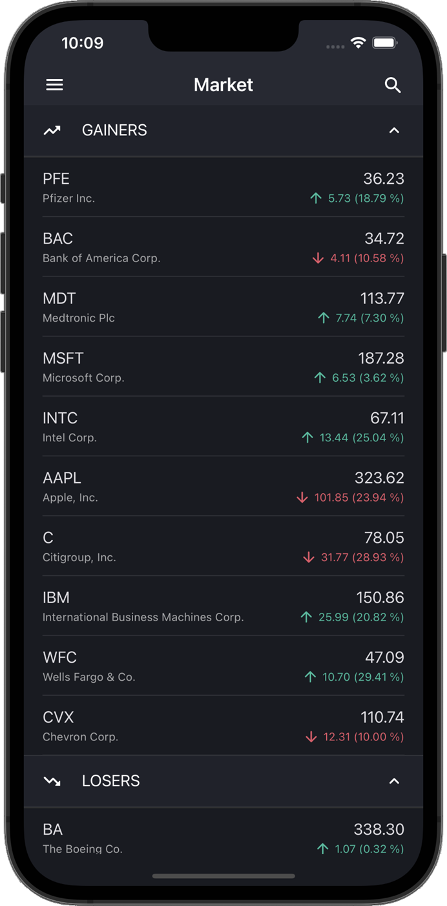
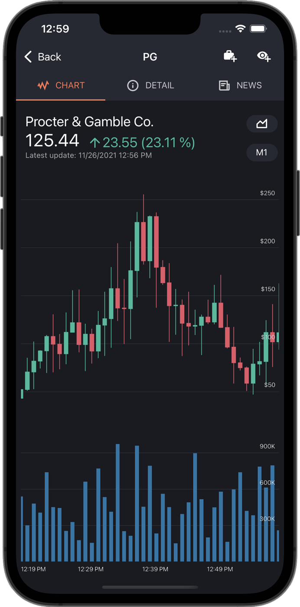

<!-- default badges list -->

<!-- default badges end -->
## Mobile UI for Xamarin.Forms - Stock Market

[DevExpress Mobile UI](https://www.devexpress.com/xamarin/) allows you to use a .NET cross-platform UI toolkit and C# to build native apps for iOS and Android.

The **DevExpress Mobile UI for Xamarin.Forms and .NET MAUI** is free of charge. To learn more about our offer and reserve your copy, please visit the following webpage: [Free DevExpress Mobile UI for Xamarin.Forms and .NET MAUI](https://www.devexpress.com/xamarin-free).

### Requirements

Please register the DevExpress NuGet Gallery in Visual Studio to restore NuGet packages used in this solution. See the following topic for more information: [Get Started with DevExpress Mobile UI for Xamarin.Forms](https://docs.devexpress.com/MobileControls/403540/xamarin-forms/get-started).

### What's in This Repository

This repository contains a sample stock trading application.

 

The application contains the following pages:

- [Market](./CS/Stocks.UI/Views/MarketPage) - displays a snapshot of market conditions (most active stocks, biggest gains/losses).
- [Stock Detail](./CS/Stocks.UI/Views/SymbolPage) - displays detailed stock information.
- [Search](./CS/Stocks.UI/Views/SearchSymbolPage) - allows users to add stock symbols to a watchlist.
- [Watchlist](./CS/Stocks.UI/Views/WatchlistPage) - displays a list of stocks added to the watchlist.
- [Watchlist News](./CS/Stocks.UI/Views/NewsPage) - displays news for the stocks in the watchlist.
- [Portfolio](./CS/Stocks.UI/Views/PortfolioPage) - allows users to enter buy/sell orders to measure their stock market acumen.

This application uses the following DevExpress Xamarin.Forms controls:

- [DrawerPage](https://docs.devexpress.com/MobileControls/401159/xamarin-forms/navigation-controls/drawer-page/index) - implements navigation in the application.
- [TabPage](https://docs.devexpress.com/MobileControls/401160/xamarin-forms/navigation-controls/tab-page/index) and [TabView](https://docs.devexpress.com/MobileControls/401161/xamarin-forms/navigation-controls/tab-view/index) - implements navigation between views within a page.
- [DataGridView](https://docs.devexpress.com/MobileControls/DevExpress.XamarinForms.DataGrid.DataGridView) - displays information on app pages. The following grid features are used: [template column](https://docs.devexpress.com/MobileControls/DevExpress.XamarinForms.DataGrid.TemplateColumn), data [sorting](https://docs.devexpress.com/MobileControls/400552/xamarin-forms/data-grid/getting-started/lesson-5-sort-data) and [grouping](https://docs.devexpress.com/MobileControls/400550/xamarin-forms/data-grid/getting-started/lesson-3-group-data), and [swipe actions](https://docs.devexpress.com/MobileControls/401053/xamarin-forms/data-grid/examples/swipe-actions). 
- [Charts](http://docs.devexpress.com/MobileControls/400422/xamarin-forms/charts/index) - visualize financial data as Open-High-Low-Close series, bars, lines, donuts, etc.

### Documentation

- [Data Grid](http://docs.devexpress.com/MobileControls/400543/xamarin-forms/data-grid/index)
- [Charts](http://docs.devexpress.com/MobileControls/400422/xamarin-forms/charts/index)
- [Scheduler](http://docs.devexpress.com/MobileControls/400676/xamarin-forms/scheduler/index)
- [Collection View](http://docs.devexpress.com/MobileControls/402074/xamarin-forms/collection-view/index)
- [Navigation](http://docs.devexpress.com/MobileControls/400544/xamarin-forms/navigation-controls/index)
- [Data Form](https://docs.devexpress.com/MobileControls/401732/xamarin-forms/data-form/index)
- [Data Editors](https://docs.devexpress.com/MobileControls/401613/xamarin-forms/editors/index)

### More Examples

* [Stocks App](https://github.com/DevExpress-Examples/xamarin-forms-stocks-app)
* [Data Grid](https://github.com/DevExpress-Examples/xamarin-forms-data-grid-examples)
* [Charts](https://github.com/DevExpress-Examples/xamarin-forms-chart-examples)
* [Scheduler](https://github.com/DevExpress-Examples/xamarin-forms-scheduler-examples)
* [Collection View](https://github.com/DevExpress-Examples/xamarin-forms-collection-view-examples)
* [Navigation](https://github.com/DevExpress-Examples/xamarin-forms-navigation-examples)
* [Data Form](https://github.com/DevExpress-Examples/xamarin-forms-data-form-examples)
* [Data Editors](https://github.com/DevExpress-Examples/xamarin-forms-editors-examples)